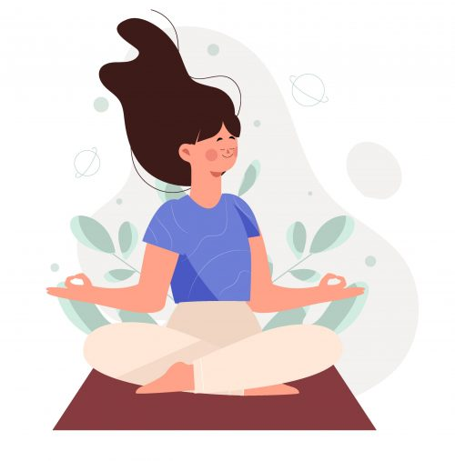

# Los Beneficios de la Meditación

La meditación es una práctica milenaria que ha sido adoptada en diversas culturas y tradiciones. A continuación, exploraremos algunos de sus principales beneficios para la salud física y mental.

## Beneficios para la Salud Mental

- **Reducción del Estrés**: La meditación puede ayudar a reducir los niveles de cortisol, la hormona del estrés.
- **Mejora de la Concentración**: Practicar la meditación mejora la atención y la capacidad de concentración.
- **Aumento de la Autoestima**: La meditación fomenta una visión positiva de uno mismo.

### Beneficios para la Salud Física

1. **Mejora del Sueño**: La meditación ayuda a calmar la mente, lo que puede facilitar un sueño reparador.
2. **Control de la Ansiedad**: La práctica regular puede disminuir los síntomas de ansiedad.
3. **Fortalecimiento del Sistema Inmunológico**: Estudios sugieren que la meditación puede mejorar la respuesta inmunitaria del cuerpo.

)

## Tipos de Meditación

Existen diferentes tipos de meditación, cada una con sus propios enfoques y beneficios:

- **Meditación de Atención Plena**: Enfocarse en el momento presente.
- **Meditación Trascendental**: Repetición de mantras para alcanzar un estado de paz.
- **Meditación Guiada**: Uso de guías o audios para facilitar la práctica.

## Tabla de Beneficios de la Meditación

| Beneficio                  | Descripción                                                      |
|---------------------------|------------------------------------------------------------------|
| Reducción del Estrés      | Disminuye la ansiedad y mejora la sensación de bienestar.       |
| Mejora de la Concentración | Aumenta la capacidad de atención y enfoque en tareas.          |
| Fortalecimiento del Sueño  | Promueve un sueño más profundo y reparador.                    |

## Recursos Adicionales

Para más información sobre la meditación, puedes consultar los siguientes enlaces:

- [Mindful](https://www.mindful.org) - Un recurso completo sobre la atención plena.
- [Headspace](https://www.headspace.com) - Aplicación para meditación guiada.
- [Meditation Oasis](https://www.meditationoasis.com) - Ofrece meditaciones y recursos variados.

### Conclusión

La meditación es una práctica accesible que puede traer numerosos beneficios a la salud física y mental. Incorporarla en la rutina diaria puede resultar en una vida más equilibrada y satisfactoria.
